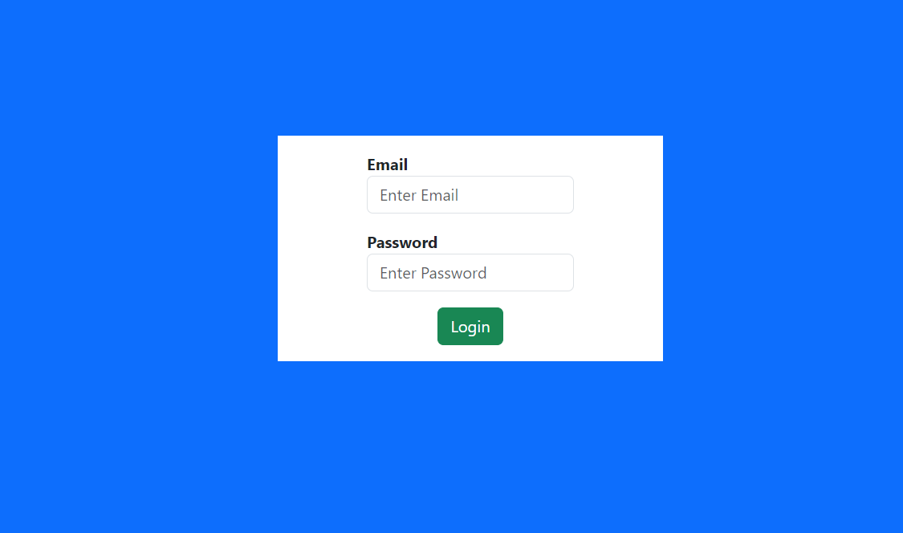
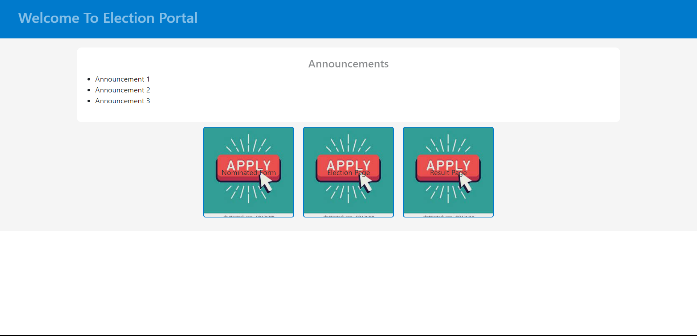
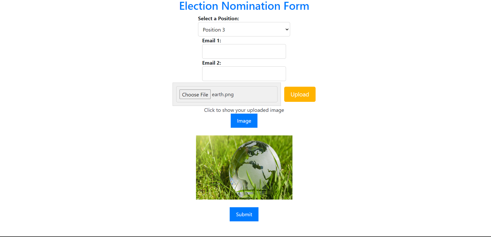
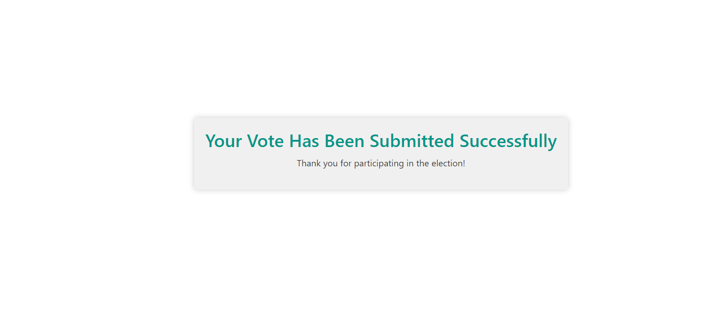

# Election Portal Website
### with login page, nomination page, election page and result page

Used ExpressJS, ReactJS, MySQL

# Login Page

# HomePage Page

# Nomination Page

# After Successfully Voted

# For Backend
- Install XAMPP Apache Server for MySQL Database
- Create user and schema for your database
- Then Install the required modules using 'npm i'
- Run the backend using 'npm start'
- Finally DB get connect and server is running on Port 8085

# For Frontend
- Just install all the packages using 'npm i'
- And run the frontend using 'npm start'